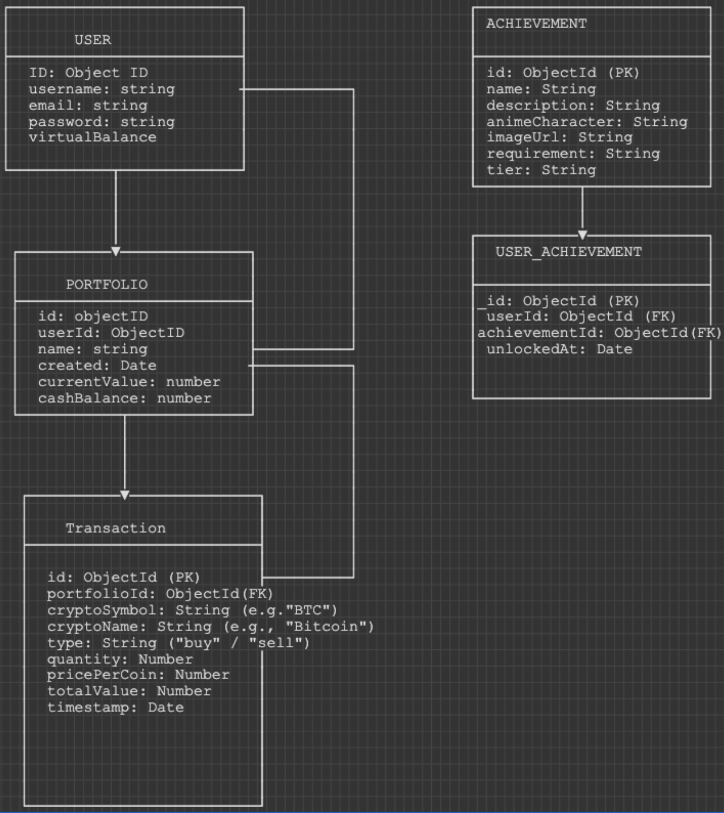

# CryptoSensei - Gamified Cryptocurrency Portfolio

# Description:

CryptoSensei is a full-stack MERN application that allows users to practice cryptocurrency trading strategies in a risk-free virtual environment. Users manage simulated portfolios using real-time market data, execute buy and sell transactions, monitor performance metrics, and unlock anime-themed achievements as they progress.

The platform is designed to help aspiring investors understand market dynamics while staying engaged through gamification and structured feedback.

---

## Features

- User authentication (register, login, logout)
- Create and manage multiple virtual portfolios
- Execute simulated buy/sell transactions with real-time crypto prices
- Track portfolio performance (total value, gains/losses, ROI)
- Achievement system with anime-themed badges and milestones
- Portfolio analytics and transaction history
- Real-time cryptocurrency price data via CoinGecko API

## Tech Stack

### Frontend

- React
- Tailwind CSS
- Axios
- Chart.js / Recharts

### Backend

- Node.js
- Express.js
- MongoDB (Mongoose)
- JWT Authentication
- bcrypt

## Backend Tree Route

```
/api
├── auth
│   ├── POST   /register               # Create new user account
│   ├── POST   /login                  # Authenticate user and return JWT
│   └── POST   /logout                 # Invalidate session
│
├── users
│   ├── GET    /:id                    # Get user profile
│   ├── PUT    /:id                    # Update user profile
│   └── GET    /:id/achievements       # Get user's achievements
│
├── portfolios
│   ├── GET    /                       # Get all user portfolios
│   ├── POST   /                       # Create new portfolio
│   ├── GET    /:id                    # Get portfolio details
│   ├── PUT    /:id                    # Update portfolio
│   ├── DELETE /:id                    # Delete portfolio
│   └── GET    /:id/performance        # Get performance metrics
│
├── transactions
│   ├── GET    /portfolio/:portfolioId # Get portfolio transactions
│   ├── POST   /                       # Create buy/sell transaction
│   ├── GET    /:id                    # Get transaction details
│   └── DELETE /:id                    # Delete transaction
│
├── crypto
│   ├── GET    /prices                 # Get multiple crypto prices
│   ├── GET    /price/:symbol          # Get single crypto price
│   └── GET    /search                 # Search cryptocurrencies
│
└── achievements
    ├── GET    /                       # Get all achievements
    └── POST   /unlock                 # Unlock achievements
```

## Data Flow



Data Flow:

User registers/logs in → Creates User document
User creates portfolio → Portfolio document linked to User
User executes trades → Transaction documents linked to Portfolio
System checks achievements after actions → Unlocks UserAchievement entries
Real-time crypto prices fetched from CoinGecko API (not stored in DB)

### Planning:

## Trello Board Link:

https://uchenna-williams-cryptosensei.atlassian.net/jira/core/projects/CRYP/board?filter=&groupBy=status&atlOrigin=eyJpIjoiNWYwYjgyODhiOTY4NGJhYmExZWJjNjUwMTAxNjk2NzciLCJwIjoiaiJ9

## Future Features

    - AI-powered trading recommendations
    -	Social trading and leaderboards
    -	Advanced risk analysis
    -	Cloud deployment (AWS/GCP)
    -	Two-factor authentication
    -	Mobile optimization

## Author

Uchenna Williams
Per Scholas MERN
